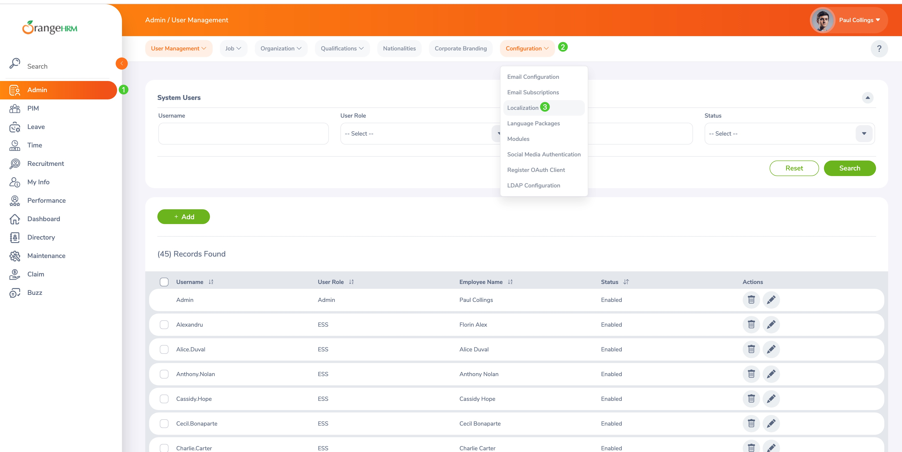
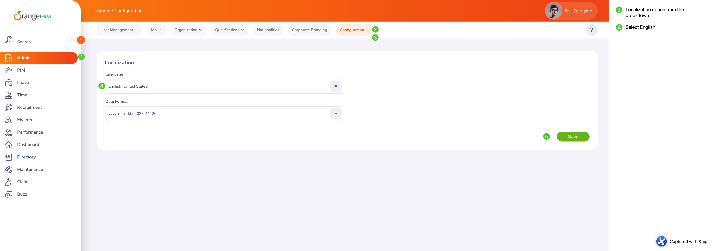

# Selenium-TestNG-Framework

This framework is updated to support Selenium 4.15
I made updates only to LoginTest Class (located in 'testcases' package)
 - All test cases are functioning within the class, all tests pass.

You can make changes (updates) to other test case classes as needed.

_**The framework is pointing to new URL, because old URL is no longer working._**

**What is new in this version:**

- Updated to latest version of Selenium which is 4.15.0 as of this git push. 
- No separate installation of webdrivers required anymore (yay! 🎉)  
- ~~Removed~~ Kept 'drivers' folder in case if you want to use local drivers (but no longer needed, safe to delete it)
- Removed WebDriverManager dependency from the POM  
- Updated some web locators (pointing to new URL)

**Notes:** New URL randomly switches to Spanish language by default. If this happens, test validations will fail since they are written to validate English version of the website.  

If this happens here is instructions on how to fix it:
1. Login to website using valid credentials
2. On the top left side main menu click on the Admin menu
3. Then on the Admin page, top left sub-menu find 'Configuration' menu click on it, its a drop-down menu
4. From the Configuration's drop-down select 'Localization' option
5. From Language drop-down field, select English and Save, exit.

Image illustration - how to change site's default language to English: 

