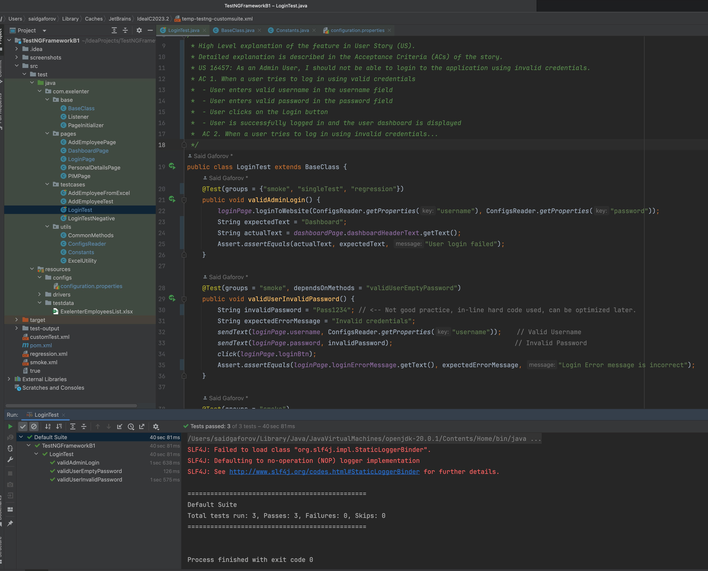
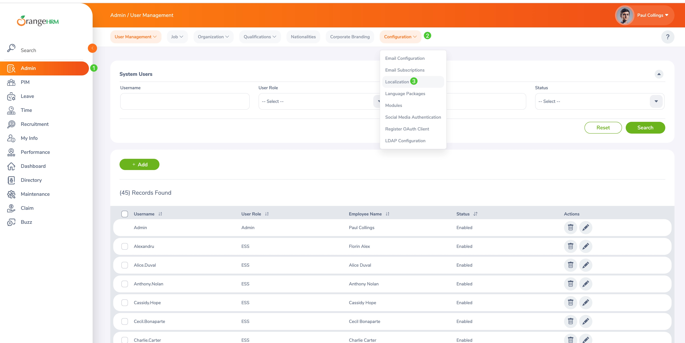
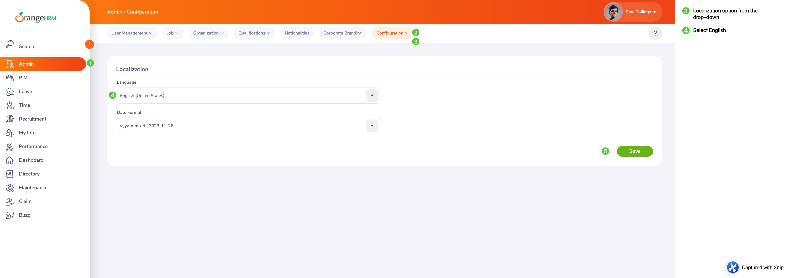

# Selenium-TestNG-Framework

This framework is updated to support Selenium 4.15  
I made updates only to the LoginTest Class (located in 'testcases' package)
- All test cases are functioning within the class, and all tests pass.
- 

You can make changes (updates) to other test case classes as needed.

_**The framework is pointing to a new URL because the old URL is no longer working._**

**What is new in this version:**

- Updated to the latest version of Selenium which is 4.15.0 as of this git push.
- No separate installation of webdrivers required anymore (yay! 🎉)  
- ~~Removed~~ Kept 'drivers' folder in case you want to use local drivers (but no longer needed, safe to delete it)
- Removed WebDriverManager dependency from the POM  
- Updated some web locators (pointing to new URL)

To run tests from the command line within the Intellij, pass the following line to IntelliJ Terminal: 
***mvn test -Dfilename=smoke.xml***

**Notes:** New URL randomly switches to Spanish language by default. If this happens, test validations will fail since they are written to validate English version of the website. 

If this happens, here are instructions on how to fix it:
1. Login to the website using valid credentials
2. On the top left side main menu click on the Admin menu
3. Then on the Admin page, top left sub-menu find the 'Configuration' menu and click on it, it's a drop-down menu
4. From the Configuration's drop-down select 'Localization' option
5. From the Language drop-down field, select English and Save, and exit.

Image illustration - how to change the site's default language to English: 

